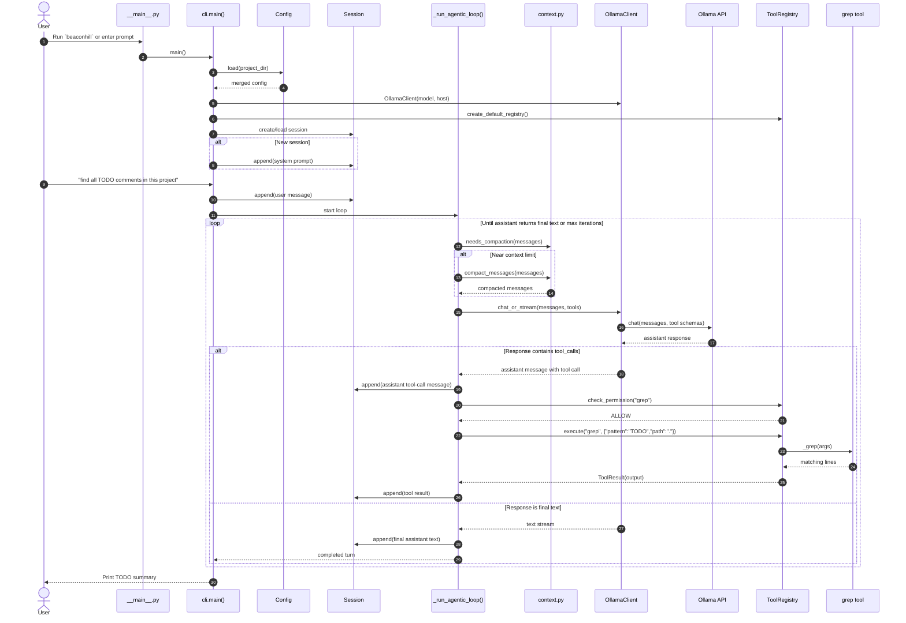

# Beaconhill Prompt Flow Sequence Diagram

This diagram shows the main request flow for a prompt like:

`find all TODO comments in this project`

```mermaid
sequenceDiagram
    autonumber
    actor User
    participant Main as __main__.py
    participant CLI as cli.main()
    participant Config as Config
    participant Session as Session
    participant Agent as _run_agentic_loop()
    participant Context as context.py
    participant Client as OllamaClient
    participant Ollama as Ollama API
    participant Registry as ToolRegistry
    participant Grep as grep tool

    User->>Main: Run `beaconhill` or enter prompt
    Main->>CLI: main()
    CLI->>Config: load(project_dir)
    Config-->>CLI: merged config
    CLI->>Client: OllamaClient(model, host)
    CLI->>Registry: create_default_registry()
    CLI->>Session: create/load session

    alt New session
        CLI->>Session: append(system prompt)
    end

    User->>CLI: "find all TODO comments in this project"
    CLI->>Session: append(user message)
    CLI->>Agent: start loop

    loop Until assistant returns final text or max iterations
        Agent->>Context: needs_compaction(messages)
        alt Near context limit
            Agent->>Context: compact_messages(messages)
            Context-->>Agent: compacted messages
        end

        Agent->>Client: chat_or_stream(messages, tools)
        Client->>Ollama: chat(messages, tool schemas)
        Ollama-->>Client: assistant response

        alt Response contains tool_calls
            Client-->>Agent: assistant message with tool call
            Agent->>Session: append(assistant tool-call message)
            Agent->>Registry: check_permission("grep")
            Registry-->>Agent: ALLOW
            Agent->>Registry: execute("grep", {"pattern":"TODO","path":"."})
            Registry->>Grep: _grep(args)
            Grep-->>Registry: matching lines
            Registry-->>Agent: ToolResult(output)
            Agent->>Session: append(tool result)
        else Response is final text
            Client-->>Agent: text stream
            Agent->>Session: append(final assistant text)
            Agent-->>CLI: completed turn
        end
    end

    CLI-->>User: Print TODO summary
```
